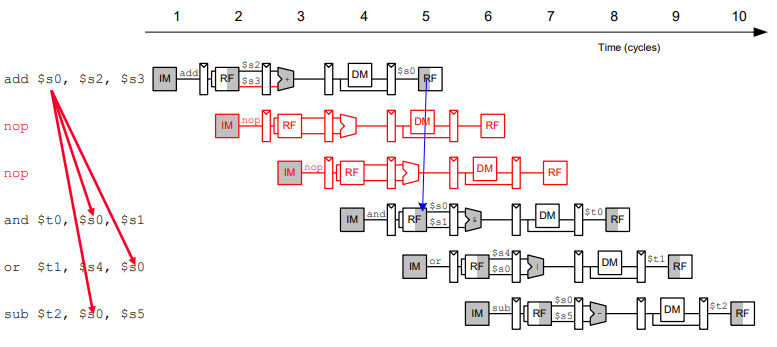
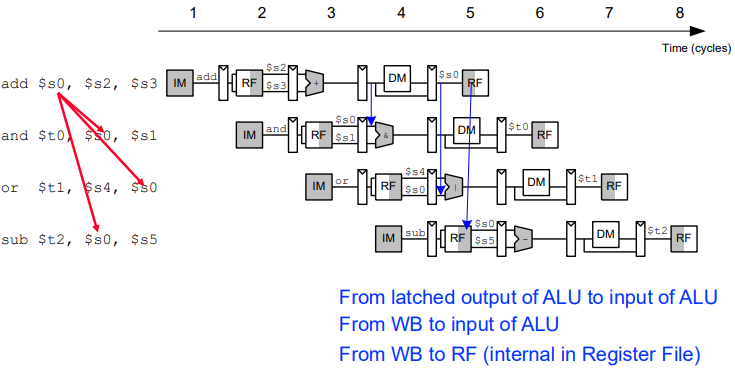
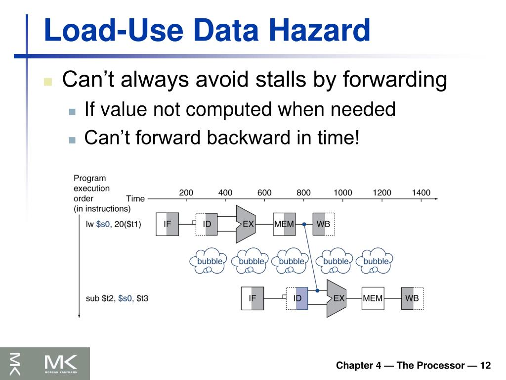

# RISCVMulticyclearchmodel

Refer https://github.com/srijamuvva3/RV32Iarchmodel/blob/main/README.md for more details

# Singlecycle vs Multicycle vs Pipelined

| Feature | Single-Cycle | Multi-Cycle | Pipelined |
| :--- | :--- | :--- | :--- |
| **Cycles Per Instruction (CPI)** | Exactly 1 | Greater than 1 (varies by instruction) | Ideal CPI = 1 (in steady state) |
| **Clock Cycle Time** | Longest (limited by the slowest full instruction) | Shortest (limited by the slowest individual stage) | Shortest (limited by the slowest individual stage + register overhead) |
| **Hardware Reuse** | None (Requires duplicate ALUs and memories) | High (Reuses ALU and memory across cycles) | Low (Each stage needs its own dedicated hardware) |
| **Control Logic** | Simple (Pure combinational logic) | Complex (Requires a Finite State Machine) | Complex (Requires hazard detection and forwarding logic) |
| **Throughput** | Low (One instruction per long clock cycle) | Low to Medium (Takes multiple short cycles per instruction) | High (Finishes an instruction every short clock cycle) |

# code directory structure

| Folder / File | Purpose |
| :--- | :--- |
| `common` | Common data structures/types |
| `ISA` | Understand RISC-V instructions |
| `execution` | ALU, registers, control |
| `memory` | Memory model |
| `multicycle` | Multicycle CPU |
| `pipelineCPU` | Pipelined CPU |
| `trace` | Execution logging |
| `tests` | Verify the CPU |
| `CMakeLists.txt` | Build everything |

# PipelineCPU Implementation

pipeline_register.h/.cpp - Here we implement four pipeline registers - IF_ID ID_EX EX_MEM MEM_WB - each of the reg acts as a package of information traveling with an instruction

pipeline_state.h - Tell the status of pipeline - Stalled/Halted/Running

pipeline_cpu.cpp - writeBackStage() memoryStage() executeStage() decodeStage() fetchStage() - basically these stages does thier tasks and sent the packet of info to the interface registers

hazard_unit.h/.cpp - handles Data and Control Hazards

Data Hazards :
Incase of Dependencies (Data Hazards - RAW, WAR, WAW)

The pipeline needs to get stalled for particular number of cycles until the dependency is met.
Example:

In this case we use Data forwarding technique, Where instead of taking it at WB we take the data right after it is available 

Load use Hazard: 
Ex: 
LW  x1,0(x2)
ADD x3,x1,x4

In this case pipeline needs to stall 